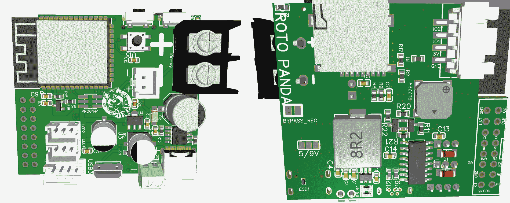
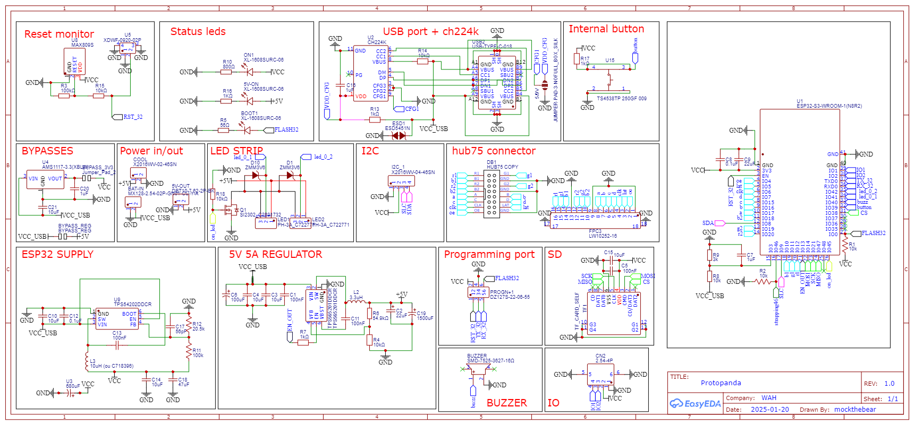
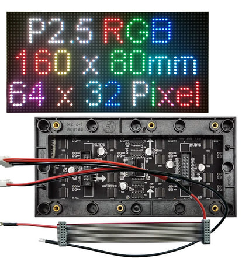
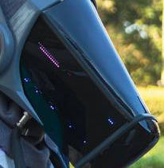
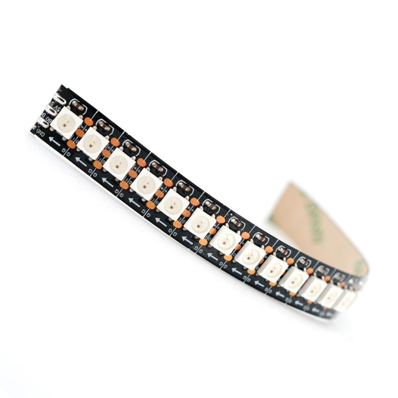
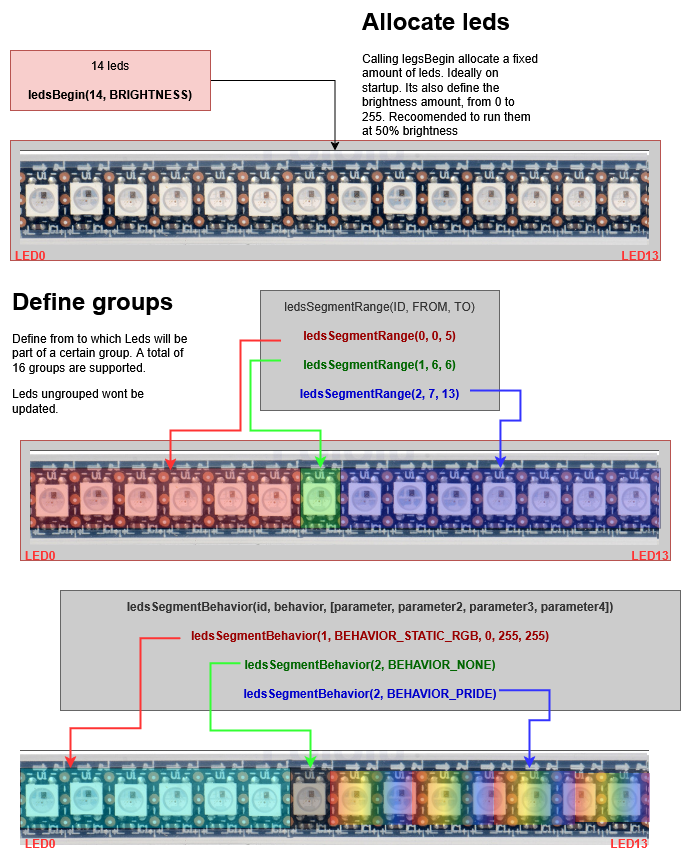
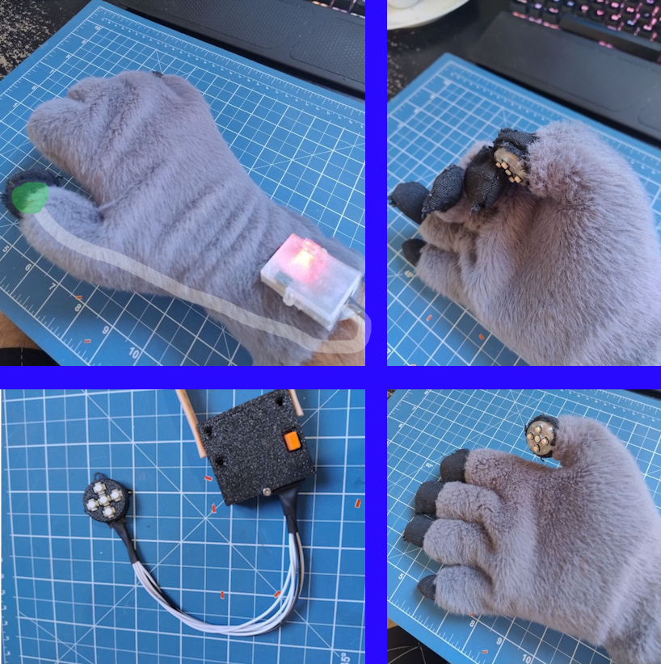

# Protopanda

Protopanda is a open source patform (firmware and hardware), for controling protogens. The idea is to be simple enough so all you need is just a bit of tech savy to make it work. But at the same time, flexible enough so an person with the minimum knowledge of lua can make amazing things.

1. [Hardware](#hardware)
2. [Diagram](#diagram)
3. [Schematic](#schematic)
4. [Two Cores](#two-cores)
5. [Powering](#powering)
6. [Panels](#panels)
7. [Face and Expressions](#face-and-expressions)
8. [LED Strips](#led-strips)
9. [Bluetooth](#bluetooth)
10. [Programming in Lua](#programming-in-lua)
11. [Lua Functions](#lua-functions)
12. [Lua Constants](#lua-constants)
13. [LED Behaviors](#led-behaviors)

# Hardware

Protopanda is designed to run on Esp32s3-n16r8, which is a version with 16MB Flash, 384kB ROM, 512 Kb RAM, and 8MB octal PSRAM.
It is required to be this version with more space and the PSRAM to have enough RAM to run the panels, BLE, and [lua](#programming-in-lua) together.

On the hardware, there is a port for the HUB75 data, an SD card connector, two screw terminals for the 5V out, the power in pins, one I2C port, and the LED strip pin.

# Diagram



# Schematic



# Two cores
Protopanda uses and abuses the two cores in the ESP32.  
* **Core 0**
By default, Core 0 is primarily designed to manage Bluetooth. When not doing so, it manages the animations, and when [Managed mode](#managed-mode) is active, it also handles the LED screen updating.
* **Core 1**
The second core handles non-screen-related tasks. It has the routine that checks the [power level](#powering), updates the inputs, reads sensors, and calls the Lua function onLoop.

# Powering 

Protopanda runs two HUB75 panels at 5V. The hardware is capable of driving 5V at 5A. The input requires 6.5V to 13V, with two buck converters. USB 5V on the input is enough to power the CPU but not enough to power the panels directly. It is expected to be powered by two 18650 lithium cells in series, but using a USB-C with PD at 9V is also acceptable.

The usage of each panel can vary. **They usually don't require more than 2A**, but some variants can reach 5A per panel at 100% brightness. You don't want to run those at 100%. Even if the hardware were capable of supplying 10A, the heat would be excessive, and the human eye perceives brightness on a logarithmic scale, so the difference from 50% to 100% is not significant. Running at 100% would also drain the battery very quickly. The power usage of the panels increases with brightness. It is recommended to run at 50% to 70% brightness.

Protopanda supports [LED strips](#led-strips), and there is a port dedicated to them. The output is also 5V, the same as the panels. Since the LEDs are the WS2812B, they can consume up to 20mA per LED at 100% brightness.

# Panels

The panels used are also known as HUB75 panels. They are driven by [mrcodetastic's hub75 lib](https://github.com/mrcodetastic/ESP32-HUB75-MatrixPanel-DMA), and these are the [recommended panels](https://pt.aliexpress.com/item/4000002686894.html).

They're multiplexed, which means only a few LEDs are on at a given time. It is fast enough that it can't be seen by the eye. But during direct sunlight, it's hard to take a good photo without screen tearing.


The resolution is 64 pixels wide and 32 pixels tall. Being two panels side by side, the total area is 128x32px. The color depth is 16 pixels, being RGB565, which means red (0-32), green (0-64), and blue (0-32).

## Double buffer

To prevent another type of tearing when a frame is being drawn while the frame is being changed, we enable the use of double buffering. This means that we draw pixels to the frame, but they won't appear on the screen immediately. Instead, we're drawing in memory. When we call `flipPanelBuffer()`, the memory we drew is sent to the DMA to be constantly drawn on the panel. Then, the buffer we use to draw changes. This increased the memory usage, but it's a price needed to pay.

# Face and expressions

Protopanda uses images from the SD card and a few JSON files to construct the animation sequences. All images must be `PNG`; later, they're decoded to a raw format and stored in the [frame bulk file](#bulk-file).

- [Loading Frames](#loading-frames)
- [Expressions](#expressions)
- [Expression Stack](#expression-stack)
- [Bulk File](#bulk-file)
- [Managed Mode](#managed-mode)

## Loading frames

To load frames, you need to add them to the SD card and specify their locations in the config.json file:
```json
{
  "frames": [
    {"pattern": "/bolinha/input-onlinegiftools-%d.png", "from": 1, "to": 155, "flip_left": false, "alias": "bolinha"},
    {"pattern": "/atlas/Atlas comissão expressão padrao frame %d Azul.png", "flip_left": true, "from": 1, "to": 4, "color_scheme_left": "rbg", "alias": "atlas"},
    {"pattern": "/atlas/Atlas comissão expressão Vergonha e boop frame %d.png", "flip_left": true, "from": 1, "to": 4, "color_scheme_left": "rbg", "alias": "vergonha"},
    {"pattern": "/atlas/trans%d.png", "flip_left": true, "from": 1, "to": 4, "color_scheme_left": "rbg", "alias": "vergonha_trans"},
    {"pattern": "/atlas/Atlas comissão expressão OWO frame %d.png", "flip_left": true, "from": 1, "to": 4, "color_scheme_left": "rbg", "alias": "owo"},
    {"pattern": "/atlas/Atlas comissão expressão cute pidao frame %d.png", "flip_left": true, "from": 1, "to": 3, "color_scheme_left": "rbg", "alias": "cute"},
    {"pattern": "/atlas/Atlas comissão expressão raiva frame %d.png", "flip_left": true, "from": 1, "to": 5, "color_scheme_left": "rbg", "alias": "anger"},
    {"pattern": "/atlas/Atlas comissão expressão apaixonado %d.png", "flip_left": true, "from": 1, "to": 2, "color_scheme_left": "rbg", "alias": "apaixonado"},
    {"pattern": "/atlas/Atlas comissão expressão surpreso frame %d.png", "flip_left": true, "from": 1, "to": 5, "color_scheme_left": "rbg", "alias": "surpreso"},
    {"pattern": "/atlas/Atlas comissão expressão feliz frame %d.png", "flip_left": true, "from": 1, "to": 4, "color_scheme_left": "rbg", "alias": "feliz"},
    {"pattern": "/atlas/Atlas comissão expressão morte frame %d.png", "flip_left": true, "from": 1, "to": 2, "color_scheme_left": "rbg", "alias": "morto"},
    {"file": "/atlas/Atlas comissão expressão tela azul.png", "flip_left": true, "alias": "tela_azul"}
  ]
}
```

> Modifying the config.json file adding or removing files will force the system to rebuild the [frame bulk file](#bulk-file).

Each element in the `frames` array, can be either the path of the file, or an object that describe multiple files.

* pattern  (string)
Much like `printf`, which uses `%d` to specify a number, when using pattern it is required to have the fields `from` and `to`. For example:
Given an example:
```json
{"pattern": "/bolinha/input-onlinegiftools-%d.png", "from": 1, "to": 155},
```
This will load `/bolinha/input-onlinegiftools-1.png` to `/bolinha/input-onlinegiftools-155.png`
* flip_left  (bool)
Due to the orientation of the panels, it might be necessary to flip the left side horizontally.
* alias  (string)
The animations are preety much like:
```
Draw frame 1
wait some time
Draw frame 2
```
This can be a problem if you hardcode the animations and need to add a frame in between. To solve this problem, you can create an alias for an image or a group of images. The alias is just an name given to the first frame of the `pattern`. Much like an offset.
* color_scheme_left  (string)
If you need to flip one or more channels, use this to do so.

## Expressions

Once the frames are loaded, and the execution starts, its the job of the (lua scripts)[#programming-in-lua] to handle the expressions. 
The expressions are stored in `expressions.json` at the root of the SD card.
```json
[
  {"name": "atlas", "use_alias": "atlas", "frames": [1,1,1,1,1,2,3,4,3,2,1], "duration": 150},
  {"name": "vergonha", "use_alias": "vergonha", "frames": [1,2,3,4], "duration": 100},
  {"name": "owo", "use_alias": "owo", "frames": [1,2,3,4,3,2,1], "duration": 250},
  {"name": "vergonha_transicao_in", "use_alias": "vergonha_trans", "frames":  [4,3,2,1], "duration": 100, "single": true},
  {"name": "vergonha_transicao_out", "use_alias": "vergonha_trans", "frames": [1,2,3,4], "duration": 100, "single": true},
  {"name": "cute", "use_alias": "cute", "frames": [1,2,3], "duration": 100},
  {"name": "anger", "use_alias": "anger", "frames": [1,1,1,2,3,4,5,4,3,2,1,1], "duration": 100},
  {"name": "apaixonado", "use_alias": "apaixonado", "frames": [1,2], "duration": 100},
  {"name": "surpreso", "use_alias": "surpreso", "frames":  [1,1,1,1,1,2,3,4,5,4,3,2,1], "duration": 100},
  {"name": "feliz", "use_alias": "feliz", "frames": [1,1,1,1,1,2,3,4,3,2,1], "duration": 150},
  {"name": "morto", "use_alias": "morto", "frames": [1,2], "duration": 100},
  {"name": "tela_azul", "use_alias": "tela_azul", "frames": [1], "duration": 100}
]
```

Each element of the array is an expression.
* **name** (string)  
  It's not required to have a name, but it's a way to make it easier to call an animation and to visualize its name on the menu.

* **use_alias** (string)  
  Imagine a scenario where you have 200 frames, and you want to create an expression with frames 50 to 55. To do so, you fill the frames object with 50 to 55. But if you add a new frame at ID 40, it will mess up your existing expression. To avoid that, you define aliases in the frames section and then use the alias to add an offset.

  For example, say your alias is "angry". Using `"use_alias": "angry"` and the frames `[0, 1, 2, 3, 4, 5]` will actually call frames 50 to 55 because the "angry" alias starts at 50.

* **frames** (int array)  
  The ID of each frame to be shown.

* **duration** (int)  
  The duration of each frame.

* **single** (bool)  
  This forces the animation to not repeat. Once it finishes, it falls back to the previous animation.

## Expression stack

The expressions are stored in a stack. So when you add an animation that doesn't repeat, it will pause the current animation and run until the end of the new animation. If you add two at the same time, the last one will be executed. When it finishes, the previous one will run.

## Bulk file

Even with the SD card, changing frames is not quite fast. The SD card interface is not fast enough. To make it faster, the images are PNG decoded to raw pixel data stored in RGB565 format inside the internal flash. All frames are stored in a single file called the `Bulk file`. This is done in a way that the frames are stored sequentially, and by keeping the file open, the transfer speed is accelerated, achieving 60fps.
Every time you add or modify a new frame, it's needed to rebuild this file. This can be done in the menu or by calling the Lua function `composeBulkFile`.

## Managed mode

The animations are processed by Core 0, so you don't have to waste some precious time on the [lua scripts](#programming-in-lua) updating it. 
It is possible to change the frame using Lua scripts... But it's also wasteful. So leave it to the other core, and you only have to worry about selecting which expressions you want!
During managed mode, the frame drawing is handled by Core 0.


# LED strips

Protopanda suport the WS2812B adderessable led protocol and it provies a simple crude system to defining a few behaviors for the strip/matrices





# Bluetooth

Protopanda uses BLE. So far, its configured to handle the fursuit paw. Its info and all source code and hardware are found here https://github.com/mockthebear/ble-fursuit-paw


Is consists of a BLE device with an LSM6DS3 3 axis accelerometer/gyro and 5 buttons. It keeps sending the sensor readings and buttons every 50~100ms.

The default UUID of the ble fursuit paw is `d4d31337-c4c3-c2c3-b4b3-b2b1a4a3a2a1` and the service for the accelerometer/gyro/buttons is `d4d3afaf-c4c3-c2c3-b4b3-b2b1a4a3a2a1`
If you want more than one remote control, is reccomended to reflash the firmware of another controller and set the `c4c3` part of the uuid to `c4c4` or somethig else.

To set both devices to be accepted, add in your `onSetup`:
```lua
function onSetup()
    startBLE()
    acceptBLETypes("d4d31337-c4c3-c2c3-b4b3-b2b1a4a3a2a1", "d4d3afaf-c4c3-c2c3-b4b3-b2b1a4a3a2a1") --will return Device ID  = 0
    acceptBLETypes("d4d31337-c4c4-c2c3-b4b3-b2b1a4a3a2a1", "d4d3afaf-c4c4-c2c3-b4b3-b2b1a4a3a2a1") --will return Device ID  = 1
    beginBleScanning()
```

I know, I know... its static and have no flexibility to accept any kind of BLE devices / services... Its a planned feature

# Programming in Lua

- [Minimum Lua Script](#minimum-lua-script)
- [Cycle Expressions Each Second](#cycle-expressions-each-second)

## Minimum lua script
```lua
--Minimum lua script on init.lua

function onSetup()
  --Function is called once, here you may start the BLE, begin scanning, configure panel, set power mode, load lib and prepare led strips and even power on
  --All calls here are called from SETUP, running on core 0
end

function onPreflight()
  --Upon here, the all lua calls are called from core 1. You can even leave this function in blank.
  --Core 0 will only start managing after 100ms (the final beep)
end

function onLoop(dt)
  --This function will be called in loop. 
  --The dt parameter is the difference in MS from the begin of the last frame and current one. Useful for storing elapsed time
end
```
## Cycle expressions each second
```lua
local expressions = dofile("/lualib/expressions.lua")
local changeExpressionTimer = 1000 --1 second

function onSetup()
  setPanelMaxBrighteness(64)
  panelPowerOn() --Brightness always start at 0
  gentlySetPanelBrighteness(64)
end

function onPreflight()
  setPanelManaged(true)
  expressions.Next()
end

function onLoop(dt)
  changeExpressionTimer = changeExpressionTimer - dt 
  if changeExpressionTimer <= 0 then 
    changeExpressionTimer = 1000 --1 second
    expressions.Next()
  end
end
```


# Lua functions

- [Power](#power)
- [System](#system)
- [Sensors](#sensors)
- [Serial Communication](#serial-communication)
- [I2C Communication](#i2c-communication)
- [Drawing](#drawing)
- [Image Decoding](#image-decoding)
- [Servo Control](#servo-control)
- [Internal Screen](#internal-screen)
- [Remote Control](#remote-control)
- [LED Strips](#led-strips-1)
- [Dictionary Functions](#dictionary-functions)

## Power
#### `waitForPower()`
Forces the process to wait until the battery or USB voltage is above a threshold.
- **Returns**: `nil`

#### `powerOn()`
Turns on the regulator, powering the panel and the 5V output.
- **Returns**: `nil`

#### `powerOff()`
Turns off the regulator.
- **Returns**: `nil`

#### `getBatteryVoltage()`
Returns the battery/USB voltage in volts.
- **Returns**: `float`

#### `setAutoCheckPowerLevel(bool)`
Sets automatic power check. If the power goes under the `setVoltageStopThreshold` and the hardware is configured using a buck converter, the voltage is cut off.
- **Returns**: `nil`

#### `gentlySetPanelBrightness(brightness, rate)`
Gradually adjusts the panel brightness to the specified level at the given rate. This function is useful for smooth transitions in brightness.
- **Parameters**:
  - `brightness` (int): The target brightness level (0-255).
  - `rate` (int): The speed at which the brightness changes (higher values mean slower transitions).
- **Returns**: `nil`

#### `setVoltageStopThreshold(voltage)`
Sets the voltage threshold at which the system will automatically shut down to prevent damage from low battery voltage.
- **Parameters**:
  - `voltage` (int): The voltage threshold in volts.
- **Returns**: `nil`

#### `setVoltageStartThreshold(voltage)`
Sets the voltage threshold at which the system will automatically power on after being shut down due to low battery voltage.
- **Parameters**:
  - `voltage` (int): The voltage threshold in volts.
- **Returns**: `nil`

#### `setPoweringMode(mode)`
Sets the powering mode of the system. The mode can be `POWER_MODE_USB_5V`, `POWER_MODE_USB_9V`, or `POWER_MODE_BATTERY`.
- **Parameters**:
  - `mode` (int): The powering mode to set.
- **Returns**: `nil`

## System

### `getFreePsram()`
Returns the amount of free PSRAM (Pseudo Static RAM) available in bytes.
- **Returns**: `int` (The amount of free PSRAM in bytes).

### `getFreeHeap()`
Returns the amount of free heap memory available in bytes.
- **Returns**: `int` (The amount of free heap memory in bytes).

#### `restart()`
Restarts the ESP32 microcontroller.
- **Returns**: `nil`

#### `getResetReason()`
Returns the reason for the last reset.
- **Returns**: `int` (One of the ESP_RST_* constants)

#### `setBrownoutDetection(bool enable)`
Enables or disables brownout detection.
- **Parameters**:
  - `enable` (bool): `true` to enable, `false` to disable
- **Returns**: `nil`

## Sensors
#### `readButtonStatus(int)`
Reads the status of the remote control button. There are a total of 5 buttons. Possible button states:
```
BUTTON_RELEASED = 0
BUTTON_JUST_PRESSED = 1
BUTTON_PRESSED = 2
BUTTON_JUST_RELEASED = 3
```
- **Parameters**:
  - `button` (int): The button ID to check.
- **Returns**: `int` (The button state).

#### `readAccelerometerX([device])`
Returns the raw value of the remote control's accelerometer sensor, X axis only.
- **Parameters**:
  - `device` (int, optional): The ID of the remote control device. Default is `0`.
- **Returns**: `float` (The raw accelerometer value on the X axis).

#### `readAccelerometerY([device])`
Returns the raw value of the remote control's accelerometer sensor, Y axis only.
- **Parameters**:
  - `device` (int, optional): The ID of the remote control device. Default is `0`.
- **Returns**: `float` (The raw accelerometer value on the Y axis).

#### `readAccelerometerZ([device])`
Returns the raw value of the remote control's accelerometer sensor, Z axis only.
- **Parameters**:
  - `device` (int, optional): The ID of the remote control device. Default is `0`.
- **Returns**: `float` (The raw accelerometer value on the Z axis).

#### `readGyroX([device])`
Returns the raw value of the remote control's gyroscope sensor, X axis only.
- **Parameters**:
  - `device` (int, optional): The ID of the remote control device. Default is `0`.
- **Returns**: `int` (The raw gyroscope value on the X axis).

#### `readGyroY([device])`
Returns the raw value of the remote control's gyroscope sensor, Y axis only.
- **Parameters**:
  - `device` (int, optional): The ID of the remote control device. Default is `0`.
- **Returns**: `int` (The raw gyroscope value on the Y axis).

#### `readGyroZ([device])`
Returns the raw value of the remote control's gyroscope sensor, Z axis only.
- **Parameters**:
  - `device` (int, optional): The ID of the remote control device. Default is `0`.
- **Returns**: `int` (The raw gyroscope value on the Z axis).

#### `hasLidar()`
Checks for the presence of a lidar.
- **Returns**: `bool` (True if a lidar is present, otherwise False).

#### `readLidar()`
Returns the distance in mm from the lidar.
- **Returns**: `int` (The distance in millimeters).

#### `getInternalButtonStatus()`
Returns the status of the internal button.
- **Returns**: `int` (1 is pressed and 0 is released).


### Serial Communication
#### `beginSerialIo(baud)`
Initializes the secondary serial port with the specified baud rate.
- **Parameters**:
  - `baud` (int): The baud rate
- **Returns**: `nil`

#### `serialIoRead()`
Reads a byte from the secondary serial port.
- **Returns**: `int` (The byte read)

#### `serialIoReadStringUntil(terminator)`
Reads a string from the secondary serial port until the specified terminator is found.
- **Parameters**:
  - `terminator` (char): The terminating character
- **Returns**: `string` (The read string)

## Drawing

### Drawing
#### `flipPanelBuffer()`
The panels have two buffers. One for drawing and the other for rendering. When the drawing is finished in one buffer, this call flips them so you can draw into the other.
- **Returns**: `nil`

#### `DrawPixel(x, y, color)`
Draws a pixel at the specified coordinates with the given color.
- **Parameters**:
  - `x` (int): The X coordinate.
  - `y` (int): The Y coordinate.
  - `color` (int): The color to draw (use `color565` or `color444` to generate the color).
- **Returns**: `nil`

#### `drawPanelCircle(x, y, radius, color)`
Draws a circle outline at the specified coordinates with the given radius and color.
- **Parameters**:
  - `x` (int): The X coordinate of the center.
  - `y` (int): The Y coordinate of the center.
  - `radius` (int): The radius of the circle.
  - `color` (int): The color to draw.
- **Returns**: `nil`

### `drawPanelChar(x, y, c, color, bg, size)`
Draws a character on the panel at the specified coordinates with the given color and background.
- **Parameters**:
  - `x` (int): The X coordinate.
  - `y` (int): The Y coordinate.
  - `c` (char): The character to draw.
  - `color` (int): The color of the character (use `color565` or `color444` to generate the color).
  - `bg` (int): The background color (use `color565` or `color444` to generate the color).
  - `size` (int): The size of the character (1 for normal size, larger values for scaling).
- **Returns**: `nil`

#### `drawPanelFillCircle(x, y, radius, color)`
Draws a filled circle at the specified coordinates with the given radius and color.
- **Parameters**:
  - `x` (int): The X coordinate of the center.
  - `y` (int): The Y coordinate of the center.
  - `radius` (int): The radius of the circle.
  - `color` (int): The color to fill.
- **Returns**: `nil`

#### `drawPanelLine(x0, y0, x1, y1, color)`
Draws a line between two points with the specified color.
- **Parameters**:
  - `x0` (int): The X coordinate of the starting point.
  - `y0` (int): The Y coordinate of the starting point.
  - `x1` (int): The X coordinate of the ending point.
  - `y1` (int): The Y coordinate of the ending point.
  - `color` (int): The color to draw.
- **Returns**: `nil`

#### `drawPanelRect(x, y, width, height, color)`
Draws a rectangle outline at the specified position with the given width, height, and color.
- **Parameters**:
  - `x` (int): The X coordinate of the top-left corner.
  - `y` (int): The Y coordinate of the top-left corner.
  - `width` (int): The width of the rectangle.
  - `height` (int): The height of the rectangle.
  - `color` (int): The color to draw.
- **Returns**: `nil`

#### `drawPanelFillRect(x, y, width, height, color)`
Draws a filled rectangle at the specified position with the given width, height, and color.
- **Parameters**:
  - `x` (int): The X coordinate of the top-left corner.
  - `y` (int): The Y coordinate of the top-left corner.
  - `width` (int): The width of the rectangle.
  - `height` (int): The height of the rectangle.
  - `color` (int): The color to fill.
- **Returns**: `nil`

#### `color444(r, g, b)`
Converts RGB888 color values to RGB444 format.
- **Parameters**:
  - `r` (int): The red component (0-255).
  - `g` (int): The green component (0-255).
  - `b` (int): The blue component (0-255).
- **Returns**: `int` (The RGB444 color value).

#### `color565(r, g, b)`
Converts RGB888 color values to RGB565 format.
- **Parameters**:
  - `r` (int): The red component (0-255).
  - `g` (int): The green component (0-255).
  - `b` (int): The blue component (0-255).
- **Returns**: `int` (The RGB565 color value).

#### `clearPanelBuffer()`
Clears the screen buffer.
- **Returns**: `nil`

#### `drawPanelFace(int)`
Draws a specific face. This face must already be loaded beforehand.
- **Parameters**:
  - `faceId` (int): The ID of the face to draw.
- **Returns**: `nil`


#### `setPanelAnimation(frames int_array, duration, [repeat, [drop, [storage]]])`
If the panel is in managed mode, this will set an animation to run on it.
- **Parameters**:
  - `frames` (int array): The IDs of each frame in the animation.
  - `duration` (int): The duration of each frame in milliseconds.
  - `repeat` (int, optional): The number of times the animation should repeat. Default is `-1` (infinite).
  - `drop` (bool, optional): If `true`, all stacked animations will be erased, and this will be the only animation.
  - `storage` (int, optional): When defined, you can query this sotrage trough `getCurrentAnimationStorage()`. Can be useful when animations share the same frames
- **Returns**: `nil`

### `getCurrentAnimationStorage()`
Returns the ID of the current animation storage being used.
- **Returns**: `int` (The current animation storage ID).

#### `setPanelManaged(bomanagedol)`
Enables or disables managed mode. In managed mode, rendering is handled asynchronously, and you only need to define animations.
- **Parameters**:
  - `managed` (bool): `true` to enable managed mode, `false` to disable.
- **Returns**: `nil`

#### `isPanelManaged()`
Returns whether the panel is in managed mode.
- **Returns**: `bool` (`true` if managed mode is enabled, otherwise `false`).

#### `getPanelCurrentFace()`
Returns the current frame ID being displayed.
- **Returns**: `int` (The current frame ID).

#### `drawPanelCurrentFrame()`
Draws the current frame.
- **Returns**: `nil`

#### `getAnimationStackSize()`
Returns the number of animations currently stacked.
- **Returns**: `int` (The number of stacked animations).

#### `popPanelAnimation()`
Removes the current animation from the stack.
- **Returns**: `nil`

#### `setPanelBrightness(brightness)`
Sets the brightness of the panel.
- **Parameters**:
  - `brightness` (int): The brightness level (0-255, where 255 is 100%).
- **Returns**: `nil`

#### `setPanelMaxBrightness(max)`
Sets the maximum brightness of the panel.
- **Parameters**:
  - `max` (int): The maximum brightness level (0-255).
- **Returns**: `nil`

#### `setSpeakingFrames(frames, frameDuration)`
Sets the frames to display when the speak sensor is triggered.
- **Parameters**:
  - `frames` (int array): The IDs of the frames to display.
  - `frameDuration` (int): The duration of each frame in milliseconds.
- **Returns**: `nil`

#### `setRainbowShader(enabled)`
Enables or disables the rainbow shader, which converts pixels to a rainbow pattern.
- **Parameters**:
  - `enabled` (bool): `true` to enable the shader, `false` to disable.
- **Returns**: `nil`

## Image Decoding

### `decodePng(filename)`
Decodes a PNG image file from the SD card and returns the raw pixel data.
- **Parameters**:
  - `filename` (string): The path to the PNG file on the SD card.
- **Returns**: `uint16` table 


## System

### Serial Communication
SerialIo means using the pins io1 and io2 as tx and rx
#### `serialWriteString(data: string)`
Writes a string to the primary serial port.

- **Parameters**:
  - `data` (string): The string to write to the serial port.
- **Returns**: `nil`

#### `serialIoWriteString(data: string)`
Writes a string to the secondary serial port.

- **Parameters**:
  - `data` (string): The string to write to the secondary serial port.
- **Returns**: `nil`

#### `serialIoAvailableForWrite()`
Returns the number of bytes available for writing in the secondary serial port.

- **Returns**: `int` (The number of bytes available for writing).

#### `serialAvailableForWrite()`
Returns the number of bytes available for writing in the primary serial port.

- **Returns**: `int` (The number of bytes available for writing).


### I2C Communication

#### `wireAvailable()`
Returns the number of bytes available for reading from the I2C bus.

- **Returns**: `int` (The number of bytes available for reading).

#### `wireBegin(addr: uint8_t)`
Initializes the I2C bus with the specified address.

- **Parameters**:
  - `addr` (uint8_t): The I2C address of the device.
- **Returns**: `bool` (`true` if successful, otherwise `false`).

#### `wireFlush()`
Flushes the I2C buffer.

- **Returns**: `nil`

#### `wireBeginTransmission(addr: uint8_t)`
Begins a transmission to the specified I2C address.

- **Parameters**:
  - `addr` (uint8_t): The I2C address of the device.
- **Returns**: `nil`

#### `wireEndTransmission(sendStop: bool)`
Ends the I2C transmission.

- **Parameters**:
  - `sendStop` (bool): If `true`, a stop condition is sent after the transmission.
- **Returns**: `uint8_t` (The status of the transmission).

#### `wireRead()`
Reads a byte from the I2C bus.

- **Returns**: `int` (The byte read from the I2C bus).

#### `wireReadBytes(length: int)`
Reads a specified number of bytes from the I2C bus.

- **Parameters**:
  - `length` (int): The number of bytes to read.
- **Returns**: `std::vector<uint8_t>` (A vector containing the bytes read).

#### `wireRequestFrom(address: uint16_t, size: size_t, sendStop: bool)`
Requests data from a specified I2C address.

- **Parameters**:
  - `address` (uint16_t): The I2C address of the device.
  - `size` (size_t): The number of bytes to request.
  - `sendStop` (bool): If `true`, a stop condition is sent after the request.
- **Returns**: `uint8_t` (The number of bytes received).

#### `wirePeek()`
Peeks at the next byte in the I2C buffer without removing it.

- **Returns**: `int` (The next byte in the buffer).

#### `wireParseFloat()`
Parses a float from the I2C buffer.

- **Returns**: `float` (The parsed float value).

#### `wireParseInt()`
Parses an integer from the I2C buffer.

- **Returns**: `int` (The parsed integer value).

#### `wireSetTimeout(timeout: uint32_t)`
Sets the timeout for I2C operations.

- **Parameters**:
  - `timeout` (uint32_t): The timeout in milliseconds.
- **Returns**: `nil`

#### `wireGetTimeout()`
Returns the current timeout for I2C operations.

- **Returns**: `uint32_t` (The timeout in milliseconds).


### System
#### `millis()`
Returns the number of milliseconds the system has been running.
- **Returns**: `int` (The number of milliseconds).

#### `delayMicroseconds(us)`
Delays execution for the specified number of microseconds.
- **Parameters**:
  - `us` (int): The number of microseconds to delay.
- **Returns**: `nil`

#### `delay(ms)`
Delays execution for the specified number of milliseconds.
- **Parameters**:
  - `ms` (int): The number of milliseconds to delay.
- **Returns**: `nil`

#### `vTaskDelay(ms)`
Delays execution for the specified number of milliseconds. This might be necessary if you're running a task that can halt the CPU 
- **Parameters**:
  - `ms` (int): The number of milliseconds to delay.
- **Returns**: `nil`

#### `digitalWrite(pin, value)`
Writes a digital value to a pin.
- **Parameters**:
  - `pin` (int): The pin number.
  - `value` (int): The value to write (`HIGH` or `LOW`).
- **Returns**: `nil`

#### `analogRead(pin)`
Reads an analog value from a pin.
- **Parameters**:
  - `pin` (int): The pin number.
- **Returns**: `int` (The analog value).

#### `pinMode(pin, mode)`
Sets the mode of a pin (e.g., `INPUT`, `OUTPUT`).
- **Parameters**:
  - `pin` (int): The pin number.
  - `mode` (int): The mode to set.
- **Returns**: `nil`

#### `digitalRead(pin)`
Reads a digital value from a pin.
- **Parameters**:
  - `pin` (int): The pin number.
- **Returns**: `int` (The digital value, `HIGH` or `LOW`).

#### `setHaltOnError(bool)`
Sets whether the system should halt on Lua errors.
- **Parameters**:
  - `halt` (bool): `true` to halt on errors, `false` to continue.
- **Returns**: `nil`

#### `composeBulkFile()`
Recreates the bulk file based on the SD card contents.
- **Returns**: `nil`

#### `getFrameAliasByName(name)`
Returns the frame ID associated with the given alias.
- **Parameters**:
  - `name` (string): The alias name.
- **Returns**: `int` (The frame ID).

#### `i2cScan()`
Scans the I2C bus for connected devices.
- **Returns**: `int array` (The addresses of connected devices).

#### `getFps()`
Returns the current frames per second (FPS) of the system.
- **Returns**: `float` (The current FPS).

### Dictionary Functions
#### `dictGet(key)`
Gets a value from persistent dictionary storage.
- **Parameters**:
  - `key` (string): The key to lookup
- **Returns**: `string` (The stored value)

#### `dictSet(key, value)`
Sets a value in persistent dictionary storage.
- **Parameters**:
  - `key` (string): The key to store
  - `value` (string): The value to store
- **Returns**: `nil`

#### `dictDel(key)`
Deletes a key from persistent dictionary storage.
- **Parameters**:
  - `key` (string): The key to delete
- **Returns**: `nil`

#### `dictSave()`
Saves the dictionary to persistent storage.
- **Returns**: `nil`

#### `dictLoad()`
Loads the dictionary from persistent storage.
- **Returns**: `nil`

#### `dictFormat()`
Formats/clears the dictionary storage.
- **Returns**: `nil`

## Dictionary Functions

#### `dictGet(key)`
Gets a value from persistent dictionary storage.
- **Parameters**:
  - `key` (string): The key to lookup
- **Returns**: `string` (The stored value)

#### `dictSet(key, value)`
Sets a value in persistent dictionary storage.
- **Parameters**:
  - `key` (string): The key to store
  - `value` (string): The value to store
- **Returns**: `nil`

#### `dictDel(key)`
Deletes a key from persistent dictionary storage.
- **Parameters**:
  - `key` (string): The key to delete
- **Returns**: `nil`

#### `dictSave()`
Saves the dictionary to persistent storage.
- **Returns**: `nil`

#### `dictLoad()`
Loads the dictionary from persistent storage.
- **Returns**: `nil`

#### `dictFormat()`
Formats/clears the dictionary storage.
- **Returns**: `nil`

## Servo Control

#### `servoPause(servoId)`
Pauses the specified servo.
- **Parameters**:
  - `servoId` (int): The ID of the servo to pause.
- **Returns**: `bool` (`true` if the servo was paused successfully, otherwise `false`).

#### `servoResume(servoId)`
Resumes the specified servo.
- **Parameters**:
  - `servoId` (int): The ID of the servo to resume.
- **Returns**: `bool` (`true` if the servo was resumed successfully, otherwise `false`).

#### `servoMove(servoId, angle)`
Moves the specified servo to the given angle.
- **Parameters**:
  - `servoId` (int): The ID of the servo to move.
  - `angle` (float): The target angle for the servo.
- **Returns**: `bool` (`true` if the servo was moved successfully, otherwise `false`).

#### `hasServo()`
Checks if the system has a servo connected.
- **Returns**: `bool` (`true` if a servo is present, otherwise `false`).

## Internal screen


### `oledDrawPixel(x, y, color)`
Draws a single pixel on the OLED screen at the specified coordinates with the given color.
- **Parameters**:
  - `x` (int): The X coordinate.
  - `y` (int): The Y coordinate.
  - `color` (int): The color to draw (1 for white, 0 for black).
- **Returns**: `nil`

### `oledSetTextColor(fg[, bg])`
Sets the text color for drawing on the OLED screen.
- **Parameters**:
  - `fg` (int): The foreground color (1 for white, 0 for black).
  - `bg` (int, optional): The background color (1 for white, 0 for black).
- **Returns**: `nil`

#### `oledSetCursor(x, y)`
Sets the cursor position on the OLED screen.
- **Parameters**:
  - `x` (int): The X coordinate.
  - `y` (int): The Y coordinate.
- **Returns**: `nil`

#### `oledFaceToScreen(x, y)`
Draws the current image being displayed on the outer panels to the internal screen at the specified position.
- **Parameters**:
  - `x` (int): The X coordinate.
  - `y` (int): The Y coordinate.
- **Returns**: `nil`

#### `oledDrawTopBar()`
Draws the top bar with a few utilities.
- **Returns**: `nil`

#### `oledClearScreen()`
Clears the OLED screen buffer.
- **Returns**: `nil`

#### `oledDisplay()`
Sends the buffer to the OLED screen.
- **Returns**: `nil`

#### `oledDrawText(msg string)`
Draws text at the current cursor position.
- **Parameters**:
  - `msg` (string): The text to draw.
- **Returns**: `nil`

#### `oledDrawRect(x, y, width, height, color)`
Draws a rectangle on the OLED screen.
- **Parameters**:
  - `x` (int): The X coordinate.
  - `y` (int): The Y coordinate.
  - `width` (int): The width of the rectangle.
  - `height` (int): The height of the rectangle.
  - `color` (int): The color to draw (1 for white, 0 for black).
- **Returns**: `nil`

#### `oledCreateIcon(width, height, data)`
Creates an icon from the provided data and returns its ID.
- **Parameters**:
  - `width` (int): The width of the icon.
  - `height` (int): The height of the icon.
  - `data` (int array): The binary data for the icon.
- **Returns**: `int` (The icon ID).

#### `oledDrawIcon(x, y, iconId)`
Draws an icon at the specified position.
- **Parameters**:
  - `x` (int): The X coordinate.
  - `y` (int): The Y coordinate.
  - `iconId` (int): The ID of the icon to draw.
- **Returns**: `nil`

## Remote control
#### `startBLE()`
Starts the Bluetooth Low Energy (BLE) radio and interface.
- **Returns**: `bool` (`true` if successful, otherwise `false`).

#### `getConnectedRemoteControls()`
Returns the number of connected remote controls.
- **Returns**: `int` (The number of connected devices).

#### `isElementIdConnected(id)`
Checks if a remote control with the given ID is connected.
- **Parameters**:
  - `id` (int): The ID of the remote control.
- **Returns**: `bool` (`true` if connected, otherwise `false`).

#### `beginBleScanning()`
Starts scanning for BLE devices.
- **Returns**: `nil`

#### `setScanInterval(seconds)`
Sets the interval for scanning for BLE devices.
- **Parameters**:
  - `seconds` (int): The scan interval in seconds.
- **Returns**: `nil`

#### `setMaximumControls(count)`
Sets the maximum number of connected remote controls.
- **Parameters**:
  - `count` (int): The maximum number of devices.
- **Returns**: `nil`

#### `acceptBLETypes(service, characteristicStream, characteristicId)`
Now takes 3 parameters instead of 2:
- **Parameters**:
  - `service` (string): The service UUID
  - `characteristicStream` (string): The stream characteristic UUID
  - `characteristicId` (string): The ID characteristic UUID
- **Returns**: `int` (The ID of the accepted BLE type)

## Led strips

#### `ledsBegin(led_count[], max_brightness])`
Initializes the LED strip with the specified number of LEDs and optional maximum brightness.
- **Parameters**:
  - `led_count` (int): The number of LEDs in the strip.
  - `max_brightness` (int, optional): The maximum brightness level (0-255). Default is 128.
- **Returns**: `bool` (`true` if successful, otherwise `false`).

#### `ledsSegmentRange(id int, from int, to int)`
Defines a segment of the LED strip for independent control.
- **Parameters**:
  - `id` (int): The segment ID (0-15).
  - `from` (int): The starting LED index.
  - `to` (int): The ending LED index.
- **Returns**: `nil`

#### `ledsSegmentBehavior(id, behavior, [parameter, parameter2, parameter3, parameter4])`
Sets the behavior for a specific LED segment.
- **Parameters**:
  - `id` (int): The segment ID (0-15).
  - `behavior` (int): The behavior to set (e.g., `BEHAVIOR_PRIDE`, `BEHAVIOR_ROTATE`, etc.).
  - `parameter` (int, optional): Additional parameter for the behavior.
  - `parameter2` (int, optional): Additional parameter for the behavior.
  - `parameter3` (int, optional): Additional parameter for the behavior.
  - `parameter4` (int, optional): Additional parameter for the behavior.
- **Returns**: `nil`

#### `ledsSegmentTweenBehavior(id, behavior, [parameter, parameter2, parameter3, parameter4])`
Sets a tween behavior for a specific LED segment, transitioning smoothly to the new behavior.
- **Parameters**:
  - `id` (int): The segment ID (0-15).
  - `behavior` (int): The behavior to transition to (e.g., `BEHAVIOR_PRIDE`, `BEHAVIOR_ROTATE`, etc.).
  - `parameter` (int, optional): Additional parameter for the behavior.
  - `parameter2` (int, optional): Additional parameter for the behavior.
  - `parameter3` (int, optional): Additional parameter for the behavior.
  - `parameter4` (int, optional): Additional parameter for the behavior.
- **Returns**: `nil`

#### `ledsSegmentTweenSpeed(id, speed)`
Sets the tween speed for a specific LED segment.
- **Parameters**:
  - `id` (int): The segment ID (0-15).
  - `speed` (int): The tween speed (higher values mean slower transitions).
- **Returns**: `nil`


#### `setLedColor(id, r, g, b)`
Sets the tween speed for a specific LED segment. Ideally used with a led not assigned to any group.
- **Parameters**:
  - `id` (int): individual led
  - `r` (int):Color red (0-255).
  - `g` (int):Color green (0-255).
  - `b` (int):Color blue (0-255).
- **Returns**: `nil`

## To be used on command line

## startPanels()
Init the panels and allocate the memmory for the DMA

## Serial Communication

### Primary Serial (USB/Console)

#### `serialAvailable()`
Returns the number of bytes available to read from the primary serial port.
- **Returns**: `int` (Number of bytes available)

#### `serialRead()`
Reads one byte from the primary serial port.
- **Returns**: `int` (The byte read, or -1 if none available)

#### `serialReadStringUntil(terminator)`
Reads characters from the primary serial port until the terminator is found.
- **Parameters**:
  - `terminator` (char, optional): The terminating character (default: '\n')
- **Returns**: `string` (The read string)

#### `serialAvailableForWrite()`
Returns the number of bytes that can be written without blocking.
- **Returns**: `int` (Available space in output buffer)

#### `serialWrite(data)`
Writes a single byte to the primary serial port.
- **Parameters**:
  - `data` (int): The byte to write (0-255)
- **Returns**: `int` (Number of bytes written)

#### `serialWriteString(data)`
Writes a string to the primary serial port.
- **Parameters**:
  - `data` (string): The string to write
- **Returns**: `int` (Number of bytes written)

### Secondary Serial (IO1/IO2)

#### `beginSerialIo(baud)`
Initializes the secondary serial port (IO1/IO2 pins).
- **Parameters**:
  - `baud` (int, optional): Baud rate (default: 115200)
- **Returns**: `nil`

#### `serialIoAvailable()`
Returns the number of bytes available to read from the secondary serial port.
- **Returns**: `int` (Number of bytes available)

#### `serialIoRead()`
Reads one byte from the secondary serial port.
- **Returns**: `int` (The byte read, or -1 if none available)

#### `serialIoReadStringUntil(terminator)`
Reads characters from the secondary serial port until the terminator is found.
- **Parameters**:
  - `terminator` (char, optional): The terminating character (default: '\n')
- **Returns**: `string` (The read string)

#### `serialIoAvailableForWrite()`
Returns the number of bytes that can be written without blocking to secondary serial.
- **Returns**: `int` (Available space in output buffer)

#### `serialIoWrite(data)`
Writes a single byte to the secondary serial port.
- **Parameters**:
  - `data` (int): The byte to write (0-255)
- **Returns**: `int` (Number of bytes written)

#### `serialIoWriteString(data)`
Writes a string to the secondary serial port.
- **Parameters**:
  - `data` (string): The string to write
- **Returns**: `int` (Number of bytes written)

## I2C Communication

#### `wireBegin(address)`
Initializes I2C communication as a master or slave.
- **Parameters**:
  - `address` (uint8_t): 7-bit slave address (0 for master mode)
- **Returns**: `bool` (true if successful)

#### `wireAvailable()`
Returns the number of bytes available for reading.
- **Returns**: `int` (Number of bytes available)

#### `wireBeginTransmission(address)`
Begins a transmission to the specified I2C device.
- **Parameters**:
  - `address` (uint8_t): 7-bit device address
- **Returns**: `nil`

#### `wireEndTransmission([sendStop])`
Ends a transmission to the I2C device.
- **Parameters**:
  - `sendStop` (bool, optional): Whether to send stop condition (default: true)
- **Returns**: `uint8_t` (Transmission status code)

#### `wireRequestFrom(address, size, [sendStop])`
Requests bytes from an I2C slave device.
- **Parameters**:
  - `address` (uint16_t): 7-bit device address
  - `size` (size_t): Number of bytes to request
  - `sendStop` (bool, optional): Whether to send stop condition (default: true)
- **Returns**: `uint8_t` (Number of bytes received)

#### `wireRead()`
Reads one byte from the I2C buffer.
- **Returns**: `int` (The byte read)

#### `wireReadBytes(length)`
Reads multiple bytes from the I2C buffer.
- **Parameters**:
  - `length` (int): Number of bytes to read
- **Returns**: `table` (Array of bytes read)

#### `wirePeek()`
Peeks at the next byte in the I2C buffer without removing it.
- **Returns**: `int` (The next byte)

#### `wireFlush()`
Flushes the I2C buffer.
- **Returns**: `nil`

#### `wireParseFloat()`
Parses a float from the I2C buffer.
- **Returns**: `float`

#### `wireParseInt()`
Parses an integer from the I2C buffer.
- **Returns**: `int`

#### `wireSetTimeout(timeout)`
Sets the I2C operation timeout.
- **Parameters**:
  - `timeout` (uint32_t): Timeout in milliseconds
- **Returns**: `nil`

#### `wireGetTimeout()`
Gets the current I2C operation timeout.
- **Returns**: `uint32_t` (Timeout in milliseconds)

# Lua Constants

- [Engine Related](#engine-related)
- [Input](#input)
- [LED Behavior](#led-behavior)
- [Pins](#pins)
- [ESP32 Reset Reason](#esp32-reset-reason)

## Engine related

- `PANDA_VERSION`: A string constant representing the current version of the Protopanda firmware.
- `VCC_THRESHOLD_START`: The minimum voltage threshold required for the system to start.
- `VCC_THRESHOLD_HALT`: The minimum voltage threshold below which the system will halt to prevent damage.
- `OLED_SCREEN_WIDTH`: The width of the internal OLED screen in pixels.
- `OLED_SCREEN_HEIGHT`: The height of the internal OLED screen in pixels.
- `PANEL_WIDTH`: The width of the HUB75 panel in pixels.
- `PANEL_HEIGHT`: The height of the HUB75 panel in pixels.
- `POWER_MODE_USB_5V`: Power mode for USB 5V input.
- `POWER_MODE_USB_9V`: Power mode for USB 9V input.
- `POWER_MODE_BATTERY`: Power mode for battery input.
- `MAX_BLE_BUTTONS`:  Number of buttons per BLE device.
- `MAX_BLE_CLIENTS`: Maximum number of connected BLE devices.
- `SERVO_COUNT`: The number of servos.

## Input

- `BUTTON_RELEASED`: Indicates that a button is in the released state (not pressed).
- `BUTTON_JUST_PRESSED`: Indicates that a button has just been pressed (transition from released to pressed).
- `BUTTON_PRESSED`: Indicates that a button is currently pressed.
- `BUTTON_JUST_RELEASED`: Indicates that a button has just been released (transition from pressed to released).
- `DEVICE_X_BUTTON_LEFT`: Button mapping for left button on device (0 to `MAX_BLE_CLIENTS`).
- `DEVICE_X_BUTTON_RIGHT`: Button mapping for right button on device (0 to  `MAX_BLE_CLIENTS`).
- `DEVICE_X_BUTTON_UP`: Button mapping for up button on device (0 to `MAX_BLE_CLIENTS`).
- `DEVICE_X_BUTTON_DOWN`: Button mapping for down button on device (0 to `MAX_BLE_CLIENTS`).
- `DEVICE_X_BUTTON_CONFIRM`: Button mapping for confirm button on device (0 to `MAX_BLE_CLIENTS`).
- `BUTTON_LEFT`: Same as DEVICE_0_BUTTON_LEFT
- `BUTTON_RIGHT`: Same as DEVICE_0_BUTTON_RIGHT
- `BUTTON_UP`: Same as DEVICE_0_BUTTON_UP
- `BUTTON_CONFIRM`: Same as DEVICE_0_BUTTON_CONFIRM
- `BUTTON_DOWN`: Same as DEVICE_0_BUTTON_DOWN


## Led Behavior

- `BEHAVIOR_PRIDE`: Displays a rainbow color pattern on the LED strip.
- `BEHAVIOR_ROTATE`: Rotates colors along the LED strip.
- `BEHAVIOR_RANDOM_COLOR`: Randomly changes the color of LEDs.
- `BEHAVIOR_FADE_CYCLE`: Cycles through colors with a fading effect.
- `BEHAVIOR_ROTATE_FADE_CYCLE`: Combines rotation and fading effects for a dynamic display.
- `BEHAVIOR_STATIC_RGB`: Sets a static RGB color for the LEDs.
- `BEHAVIOR_STATIC_HSV`: Sets a static HSV color for the LEDs.
- `BEHAVIOR_RANDOM_BLINK`: Randomly blinks LEDs on and off.
- `BEHAVIOR_ROTATE_SINE_V`: Rotates colors with a sine wave effect on the V (value) component of HSV.
- `BEHAVIOR_ROTATE_SINE_S`: Rotates colors with a sine wave effect on the S (saturation) component of HSV.
- `BEHAVIOR_ROTATE_SINE_H`: Rotates colors with a sine wave effect on the H (hue) component of HSV.
- `BEHAVIOR_FADE_IN`: Gradually fades in the LEDs from off to a specified color.
- `MAX_LED_GROUPS`: Number os avaliable led groups

## Pins
- `D1`, `D2`: The external io, io1 and io2
- `HIGH`, `LOW`: Constants representing high and low states for digital pins.
- `INPUT`, `OUTPUT`: Constants representing pin modes.
- `INPUT_PULLUP`, `INPUT_PULLDOWN`: Constants representing pull-up and pull-down modes for input pins.
- `ANALOG`: Constant representing analog pin mode.
- `OUTPUT_OPEN_DRAIN`, `OPEN_DRAIN`: Constants representing open-drain output mode.
- `PULLDOWN`: Constant representing pull-down mode.

## ESP32 reset reason
- `ESP_RST_UNKNOWN`
- `ESP_RST_POWERON` 
- `ESP_RST_EXT`
- `ESP_RST_SW`
- `ESP_RST_PANIC`
- `ESP_RST_INT_WDT`
- `ESP_RST_TASK_WDT`
- `ESP_RST_WDT`
- `ESP_RST_DEEPSLEEP`
- `ESP_RST_BROWNOUT`
- `ESP_RST_SDIO`

# Led behaviors

* `BEHAVIOR_PRIDE`
  - **Description**: A rainbow effect that cycles through colors in a smooth, pride-flag-like pattern.
  - **Parameters**: None.

* `BEHAVIOR_ROTATE`
  - **Description**: Rotates a single color through the segment, creating a moving light effect.
  - **Parameters**: 
    - `1`: Red (0-255).
    - `2`: Green (0-255).
    - `3`: Blue (0-255).
    - `4`: Speed of rotation (delay in milliseconds).

* `BEHAVIOR_RANDOM_COLOR`
  - **Description**: Sets each LED in the segment to a random color.
  - **Parameters**: None.

* `BEHAVIOR_FADE_CYCLE`
  - **Description**: Fades the brightness of the LEDs in the segment up and down in a cycle.
  - **Parameters**: 
    - `1`: Hue value (0-255).
    - `2`: Controls the speed of the fade cycle.
    - `3`: Minimum brightness value.

* `BEHAVIOR_ROTATE_FADE_CYCLE`
  - **Description**: Combines rotation and fading, creating a moving light effect with fading brightness.
  - **Parameters**: 
    - `1`: Hue value (0-255).
    - `2`: Controls the speed of the fade cycle.
    - `3`: Minimum brightness value.
    - `4`: Speed of rotation (delay in milliseconds).

* `BEHAVIOR_STATIC_RGB`
  - **Description**: Sets all LEDs in the segment to a static RGB color.
  - **Parameters**: 
    - `1`: Red value (0-255).
    - `2`: Green value (0-255).
    - `3`: Blue value (0-255).

* `BEHAVIOR_STATIC_HSV`
  - **Description**: Sets all LEDs in the segment to a static HSV color.
  - **Parameters**: 
    - `1`: Hue value (0-255).
    - `2`: Saturation value (0-255).
    - `3`: Brightness value (0-255).

* `BEHAVIOR_RANDOM_BLINK`
  - **Description**: Randomly blinks LEDs in the segment with random colors and brightness.
  - **Parameters**: 
    - `1`: Base hue value (0-255).
    - `2`: Range of hue variation.
    - `3`: Maximum brightness value.
    - `4`: Delay between blinks (in milliseconds).

* `BEHAVIOR_ROTATE_SINE_V`
  - **Description**: Rotates a sine wave effect through the segment, varying brightness.
  - **Parameters**: 
    - `1`: Base hue value (0-255).
    - `2`: Base brightness value (0-255).
    - `3`: Controls the speed of the sine wave.

* `BEHAVIOR_ROTATE_SINE_S`
  - **Description**: Rotates a sine wave effect through the segment, varying saturation.
  - **Parameters**: 
    - `1`: Base hue value (0-255).
    - `2`: Base brightness value (0-255).
    - `3`: Controls the speed of the sine wave.

* `BEHAVIOR_ROTATE_SINE_H`
  - **Description**: Rotates a sine wave effect through the segment, varying hue.
  - **Parameters**: 
    - `1`: Base saturation value (0-255).
    - `2`: Base brightness value (0-255).
    - `3`: Controls the speed of the sine wave.

* `BEHAVIOR_FADE_IN`
  - **Description**: Gradually fades in the LEDs in the segment to a specified HSV color.
  - **Parameters**: 
    - `1`: Hue value (0-255).
    - `2`: Saturation value (0-255).
    - `3`: Controls the speed of the fade-in.
    - `4`: Delay between fade steps (in milliseconds).

* `BEHAVIOR_NONE`
  - **Description**: No behavior is applied. The LEDs in the segment will remain off or unchanged.
  - **Parameters**: None.