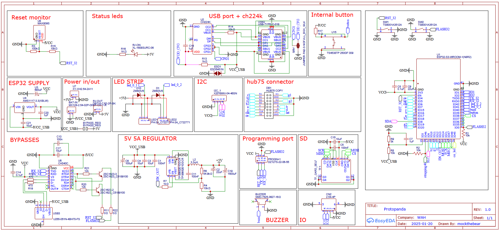

# Protopanda

__[Versão em portugues: 🇧🇷](README.pt-br.md)__

Protopanda is a open source patform (firmware and hardware), for controling protogens. The idea is to be simple enough so all you need is just a bit of tech savy to make it work. But at the same time, flexible enough so an person with the minimum knowledge of lua can make amazing things.

1. [Features](#features)
2. [Powering](#powering)
3. [Panels](#panels)
4. [Face and Expressions](#face-and-expressions)
5. [LED Strips](#led-strips)
7. [Bluetooth](#bluetooth)
7. [Hardware](#hardware)
8. [Programming in Lua](#programming-in-lua)
9. [Lua Functions](#lua-functions)
10. [Lua Constants](#lua-constants)
11. [LED Behaviors](#led-behaviors)

# Features

- Dual 32bit Xtensa LX7 cores running up to 240Mhz
- 16MB ram
- Support several HUB75 panels
- WLED support
- Can be programmed using Lua
- Data stored in a SD card
- Expressions can be shove in to the sd card as a png file
- Can reach 60fps easily
- BLE support for remote control
- USB-C pd trigger support
- Up to 5V 5A output while on PD mode
- Supports internal oled 128x64 screen for menu and UI
- gay 🏳️‍🌈

# Powering 

__TLDR: At least a power bank of 20W with PD and usb-c.__

There are two modes, one powering 5V directly from USB, and other that has some power management (buck converter), that needs from 6.5v up to 12v. This second mode is enabled only via hardware changes on the PCB.
Each hub75 panel can consume up to 2A when maximum brightness, so powering directly from USB at 5v can be problematic, so this version with the regulator triggers the PD on the usb, requesting 9V 3A, and this is plenty of power to light up both panels, sadly this version consumes way more power.

Since on most cases you wont be running them at full brightness and neither all leds on white, its reccomended the 5V version.


# Panels

The panels used are also known as HUB75 panels. They are driven by [mrcodetastic's hub75 lib](https://github.com/mrcodetastic/ESP32-HUB75-MatrixPanel-DMA), and these are the [recommended panels](https://pt.aliexpress.com/item/4000002686894.html).

They're multiplexed, which means only a few LEDs are on at a given time. It is fast enough that it can't be seen by the eye. But during direct sunlight, it's hard to take a good photo without screen tearing.


The resolution is 64 pixels wide and 32 pixels tall. Being two panels side by side, the total area is 128x32px. The color depth is 16 pixels, being RGB565, which means red (0-32), green (0-64), and blue (0-32).

## Double buffer

To prevent another type of tearing when a frame is being drawn while the frame is being changed, we enable the use of double buffering. This means that we draw pixels to the frame, but they won't appear on the screen immediately. Instead, we're drawing in memory. When we call `flipPanelBuffer()`, the memory we drew is sent to the DMA to be constantly drawn on the panel. Then, the buffer we use to draw changes. This increased the memory usage, but it's a price needed to pay.

# Face and expressions

Protopanda uses images from the SD card and a few JSON files to construct the animation sequences. All images must be `PNG`; later, they're decoded to a raw format and stored in the [frame bulk file](#bulk-file).

- [Loading Frames](#loading-frames)
- [Expressions](#expressions)
- [Expression Stack](#expression-stack)
- [Bulk File](#bulk-file)
- [Managed Mode](#managed-mode)

## Loading frames

To load frames, you need to add them to the SD card and specify their locations in the config.json file:
```json
{
  "frames": [
    {"pattern": "/bolinha/input-onlinegiftools-%d.png", "from": 1, "to": 155, "flip_left": false, "alias": "bolinha"},
    {"pattern": "/atlas/Atlas comissão expressão padrao frame %d Azul.png", "flip_left": true, "from": 1, "to": 4, "color_scheme_left": "rbg", "alias": "atlas"},
    {"pattern": "/atlas/Atlas comissão expressão Vergonha e boop frame %d.png", "flip_left": true, "from": 1, "to": 4, "color_scheme_left": "rbg", "alias": "vergonha"},
    {"pattern": "/atlas/trans%d.png", "flip_left": true, "from": 1, "to": 4, "color_scheme_left": "rbg", "alias": "vergonha_trans"},
    {"pattern": "/atlas/Atlas comissão expressão OWO frame %d.png", "flip_left": true, "from": 1, "to": 4, "color_scheme_left": "rbg", "alias": "owo"},
    {"pattern": "/atlas/Atlas comissão expressão cute pidao frame %d.png", "flip_left": true, "from": 1, "to": 3, "color_scheme_left": "rbg", "alias": "cute"},
    {"pattern": "/atlas/Atlas comissão expressão raiva frame %d.png", "flip_left": true, "from": 1, "to": 5, "color_scheme_left": "rbg", "alias": "anger"},
    {"pattern": "/atlas/Atlas comissão expressão apaixonado %d.png", "flip_left": true, "from": 1, "to": 2, "color_scheme_left": "rbg", "alias": "apaixonado"},
    {"pattern": "/atlas/Atlas comissão expressão surpreso frame %d.png", "flip_left": true, "from": 1, "to": 5, "color_scheme_left": "rbg", "alias": "surpreso"},
    {"pattern": "/atlas/Atlas comissão expressão feliz frame %d.png", "flip_left": true, "from": 1, "to": 4, "color_scheme_left": "rbg", "alias": "feliz"},
    {"pattern": "/atlas/Atlas comissão expressão morte frame %d.png", "flip_left": true, "from": 1, "to": 2, "color_scheme_left": "rbg", "alias": "morto"},
    {"file": "/atlas/Atlas comissão expressão tela azul.png", "flip_left": true, "alias": "tela_azul"}
  ]
}
```

> Modifying the config.json file adding or removing files will force the system to rebuild the [frame bulk file](#bulk-file).

Each element in the `frames` array, can be either the path of the file, or an object that describe multiple files.

* pattern  (string)
Much like `printf`, which uses `%d` to specify a number, when using pattern it is required to have the fields `from` and `to`. For example:
Given an example:
```json
{"pattern": "/bolinha/input-onlinegiftools-%d.png", "from": 1, "to": 155},
```
This will load `/bolinha/input-onlinegiftools-1.png` to `/bolinha/input-onlinegiftools-155.png`
* flip_left  (bool)
Due to the orientation of the panels, it might be necessary to flip the left side horizontally.
* alias  (string)
The animations are preety much like:
```
Draw frame 1
wait some time
Draw frame 2
```
This can be a problem if you hardcode the animations and need to add a frame in between. To solve this problem, you can create an alias for an image or a group of images. The alias is just an name given to the first frame of the `pattern`. Much like an offset.
* color_scheme_left  (string)
If you need to flip one or more channels, use this to do so.

## Expressions

Once the frames are loaded, and the execution starts, its the job of the (lua scripts)[#programming-in-lua] to handle the expressions. 
The expressions are stored in `expressions.json` at the root of the SD card.
```json
[
  {"name": "atlas", "use_alias": "atlas", "frames": [1,1,1,1,1,2,3,4,3,2,1], "duration": 150},
  {"name": "vergonha", "use_alias": "vergonha", "frames": [1,2,3,4], "duration": 100},
  {"name": "owo", "use_alias": "owo", "frames": [1,2,3,4,3,2,1], "duration": 250},
  {"name": "vergonha_transicao_in", "use_alias": "vergonha_trans", "frames":  [4,3,2,1], "duration": 100, "single": true},
  {"name": "vergonha_transicao_out", "use_alias": "vergonha_trans", "frames": [1,2,3,4], "duration": 100, "single": true},
  {"name": "cute", "use_alias": "cute", "frames": [1,2,3], "duration": 100},
  {"name": "anger", "use_alias": "anger", "frames": [1,1,1,2,3,4,5,4,3,2,1,1], "duration": 100},
  {"name": "apaixonado", "use_alias": "apaixonado", "frames": [1,2], "duration": 100},
  {"name": "surpreso", "use_alias": "surpreso", "frames":  [1,1,1,1,1,2,3,4,5,4,3,2,1], "duration": 100},
  {"name": "feliz", "use_alias": "feliz", "frames": [1,1,1,1,1,2,3,4,3,2,1], "duration": 150},
  {"name": "morto", "use_alias": "morto", "frames": [1,2], "duration": 100},
  {"name": "tela_azul", "use_alias": "tela_azul", "frames": [1], "duration": 100}
]
```

Each element of the array is an expression.
* **name** (string)  
  It's not required to have a name, but it's a way to make it easier to call an animation and to visualize its name on the menu.

* **use_alias** (string)  
  Imagine a scenario where you have 200 frames, and you want to create an expression with frames 50 to 55. To do so, you fill the frames object with 50 to 55. But if you add a new frame at ID 40, it will mess up your existing expression. To avoid that, you define aliases in the frames section and then use the alias to add an offset.

  For example, say your alias is "angry". Using `"use_alias": "angry"` and the frames `[0, 1, 2, 3, 4, 5]` will actually call frames 50 to 55 because the "angry" alias starts at 50.

* **frames** (int array)  
  The ID of each frame to be shown.

* **duration** (int)  
  The duration of each frame.

* **single** (bool)  
  This forces the animation to not repeat. Once it finishes, it falls back to the previous animation.

## Expression stack

The expressions are stored in a stack. So when you add an animation that doesn't repeat, it will pause the current animation and run until the end of the new animation. If you add two at the same time, the last one will be executed. When it finishes, the previous one will run.

## Bulk file

Even with the SD card, changing frames is not quite fast. The SD card interface is not fast enough. To make it faster, the images are PNG decoded to raw pixel data stored in RGB565 format inside the internal flash. All frames are stored in a single file called the `Bulk file`. This is done in a way that the frames are stored sequentially, and by keeping the file open, the transfer speed is accelerated, achieving 60fps.
Every time you add or modify a new frame, it's needed to rebuild this file. This can be done in the menu or by calling the Lua function `composeBulkFile`.

## Managed mode

The animations are processed by Core 0, so you don't have to waste some precious time on the [lua scripts](#programming-in-lua) updating it. 
It is possible to change the frame using Lua scripts... But it's also wasteful. So leave it to the other core, and you only have to worry about selecting which expressions you want!
During managed mode, the frame drawing is handled by Core 0.


# LED strips

Protopanda suport the WS2812B adderessable led protocol and it provies a simple crude system to defining a few behaviors for the strip/matrices


# Bluetooth

Protopanda uses BLE. So far, its configured to handle the fursuit paw. Its info and all source code and hardware are found here https://github.com/mockthebear/ble-fursuit-paw


Is consists of a BLE device with an LSM6DS3 3 axis accelerometer/gyro and 5 buttons. It keeps sending the sensor readings and buttons every 50~100ms.

The default UUID of the ble fursuit paw is `d4d31337-c4c3-c2c3-b4b3-b2b1a4a3a2a1` and the service for the accelerometer/gyro/buttons is `d4d3afaf-c4c3-c2c3-b4b3-b2b1a4a3a2a1`
If you want more than one remote control, is reccomended to reflash the firmware of another controller and set the `c4c3` part of the uuid to `c4c4` or somethig else.

To set both devices to be accepted, add in your `onSetup`:
```lua
function onSetup()
    startBLE()
    acceptBLETypes("d4d31337-c4c1-c2c3-b4b3-b2b1a4a3a2a1", "afaf", "fafb")
    beginBleScanning()
```

I know, I know... its static and have no flexibility to accept any kind of BLE devices / services... Its a planned feature


# Hardware

Protopanda is designed to run on Esp32s3-n16r8, which is a version with 16MB Flash, 384kB ROM, 512 Kb RAM, and 8MB octal PSRAM.
It is required to be this version with more space and the PSRAM to have enough RAM to run the panels, BLE, and [lua](#programming-in-lua) together.

On the hardware, there is a port for the HUB75 data, an SD card connector, two screw terminals for the 5V out, the power in pins, one I2C port, and the LED strip pin.

## Diagram


## Ports


## Schematic



## Two cores
Protopanda uses and abuses the two cores in the ESP32.  
* **Core 0**
By default, Core 0 is primarily designed to manage Bluetooth. When not doing so, it manages the animations, and when [Managed mode](#managed-mode) is active, it also handles the LED screen updating.
* **Core 1**
The second core handles non-screen-related tasks. It has the routine that checks the [power level](#powering), updates the inputs, reads sensors, and calls the Lua function onLoop.


# Programming in Lua

__[Lua functions reference](doc/lua-doc.md)__


- [Minimum Lua Script](#minimum-lua-script)
- [Cycle Expressions Each Second](#cycle-expressions-each-second)

## Minimum lua script
```lua
--Minimum lua script on init.lua

function onSetup()
  --Function is called once, here you may start the BLE, begin scanning, configure panel, set power mode, load lib and prepare led strips and even power on
  --All calls here are called from SETUP, running on core 0
end

function onPreflight()
  --Upon here, the all lua calls are called from core 1. You can even leave this function in blank.
  --Core 0 will only start managing after 100ms (the final beep)
end

function onLoop(dt)
  --This function will be called in loop. 
  --The dt parameter is the difference in MS from the begin of the last frame and current one. Useful for storing elapsed time
end
```
## Cycle expressions each second
```lua
local expressions = dofile("/lualib/expressions.lua")
local changeExpressionTimer = 1000 --1 second

function onSetup()
  setPanelMaxBrightness(64)
  panelPowerOn() --Brightness always start at 0
  gentlySetPanelBrightness(64)
end

function onPreflight()
  setPanelManaged(true)
  expressions.Next()
end

function onLoop(dt)
  changeExpressionTimer = changeExpressionTimer - dt 
  if changeExpressionTimer <= 0 then 
    changeExpressionTimer = 1000 --1 second
    expressions.Next()
  end
end
```
